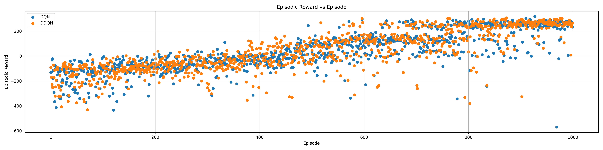
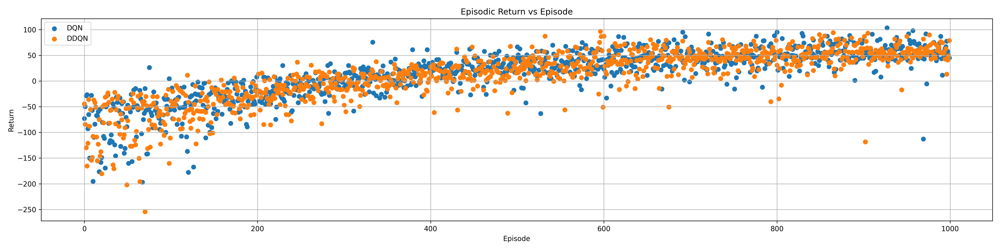
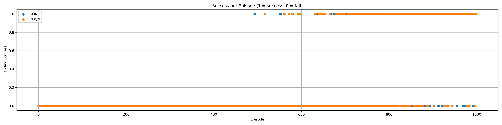

# Lunar-Lander-DQN-Implementation

Implementation of a Deep Q-Network (DQN) to solve the LunarLander-v3 environment from Gymnasium.

## Contributors:
- Zane Swaims
- Jayne Nemynova
- Emily Zapata
- Cathy Che
- Jiameng Li

## Requirements:
In order to run this project, you need Python3.10 and following libraries:
- PyTorch
- Gymnasium
- LunarLander-v3

## Instructions:
To install all required libraries, activate your virtual environment and run:

```bash
pip install "gymnasium[box2d]" torch numpy matplotlib seaborn pygame
```

After your computer is ready, to run the code, execute the following command:

```bash
python main.py
```
You will see printed results for each episode showing:
- Reward
- Return
- Steps taken
- Success or failure

Example output:
```python
Testing model in file: results/dqn_agent.pt
Episode 1       Reward: 284.96       Return: 74.01        Steps: 234        Success
Episode 2       Reward: 220.68       Return: 45.75        Steps: 418        Success
Episode 3       Reward: 274.84       Return: 85.66        Steps: 252        Success
Episode 4       Reward: 101.99       Return: 37.75        Steps: 1000       
Episode 5       Reward: 268.28       Return: 65.23        Steps: 265        Success
Testing model in file: results/ddqn_agent.pt
Episode 1       Reward: 272.01       Return: 57.11        Steps: 311        Success
Episode 2       Reward: 255.02       Return: 54.47        Steps: 270        Success
Episode 3       Reward: 278.54       Return: 76.28        Steps: 237        Success
Episode 4       Reward: 224.62       Return: 45.76        Steps: 249        Success
Episode 5       Reward: 228.56       Return: 49.13        Steps: 331        Success
```

##Hyperparameters in the Source Code

The specific values for the hyperparameters that control training behavior are set up directly in the source code (dqn_agent.py)

Here are the important ones:

```python
LEARNING_RATE = 0.0001
DISCOUNT_FACTOR = 0.99
EPSILON_DECAY = 500
```

These values are defined as constants at the top of DQNAgent class. If you wish to experiment with different values, you can manually modify these constants inside dqn_agent.py

For example:
```python
LR = 0.001         # Increase learning rate
DF = 0.95          # Discount future rewards a bit more
EPS_DECAY = 800    # Decay epsilon more slowly
```
Feel free to adjust these values or add your own. Whatever helps your agent perform better!

------------------------------------------------------------------
Final Report

## Overview of DQN

Deep Q-Networks (DQN) are a type of reinforcement learning algorithm that combines Q-learning with deep neural networks.
Traditional Q-learning maintains a table of Q-values for all possible state-action pairs, but this becomes infeasible when the state space is large or continuous.
DQN solves this by using a deep neural network to approximate the Q-value function Q(s,a) allowing the agent to generalize across similar states.

Key techniques in DQN include:

- Experience Replay: Storing past experiences and randomly sampling batches to break correlations between sequential data.

- Target Network: A slowly-updated copy of the Q-network that stabilizes training.

- Epsilon-Greedy Exploration: Balancing exploration and exploitation.

In this project, we implemented a DQN agent to solve the LunarLander-v3 environment provided by Gymnasium.

The Lunar Lander environment simulates the task of safely landing a small spacecraft on a landing pad located between two flags.
The agent must control the spacecraft using one main engine and two side thrusters while dealing with gravity and random initial conditions.

To apply DQN to Lunar Lander:

- The agent observes an 8-dimensional continuous state at each step, including the lander's position, velocity, angle, angular velocity, and whether its legs are touching the ground.

- The agent can choose from 4 discrete actions:

 - Do nothing

 - Fire left orientation engine

 - Fire main engine (to slow descent)

 - Fire right orientation engine

- At every time step, the environment provides a reward based on factors such as proximity to the landing pad, descent speed, upright orientation, leg contact, and efficient engine usage.

- Episodes end if the lander crashes, flies off-screen, or comes to rest.


The objective is to train the agent to maximize its cumulative reward by learning a policy that safely lands the spacecraft.
An episode is considered successful if the agent achieves a total score exceeding 200 points.

By combining the DQN algorithm with the Lunar Lander environment, we demonstrate the effectiveness of deep reinforcement learning in solving complex control tasks with continuous states and discrete actions.

## Description of Chosen Extension - Double DQN

While DQN is effective, it tends to overestimate Q values, leading to unstable training. Therefore, double DQN  addresses this by decoupling the action selection and action evaluation steps.

In Double DQN:
- The online network selects the best next action.
- The target network evaluates the value of that action.

This method reduces overoptimistic value estimates and results in more stable and reliable learning.

We implemented Double DQN by modifying the target update step during training instead of using the maximum Q-value estimated by the target network alone, the action is selected by the online network and evaluated using the target network.
This small change significantly improves stability and overall agent performance, especially in environments like LunarLander-v3 where precise control and accurate value estimation are critical.


## Experimental results and insights

We trained both the DQN and Double DQN (DDQN) agents for 1000 episodes each using the LunarLander-v3 environment.
Throughout training, we recorded key performance metrics including:
- Total episodic Reward
- Return G
- Landing Success Rate

Below are the training results comparing the performance of the DQN agent and the Double DQN agent over 1000 training episodes.

Episodic Reward vs Episode


- Both the DQN and double DQN agents show an upward trend in episodic rewards as training progresses.

- The double DQN agent achieves higher average rewards across episodes compared to the vanilla DQN.

- Double DQN exhibits a smoother and faster improvement, suggesting that reducing Q value overestimation helps the agent learn a more effective landing strategy.


Episodic Return vs Episode


- Both the DQN and double DQN agents show an upward trend in return over the course of training.

- The double DQN agent achieves slightly higher returns on average during the later episodes.

- Double DQN also exhibits a smoother return trajectory, indicating more stable learning compared to the vanilla DQN agent.

Success Rate Over Time


- The double DQN agent achieves successful landings earlier and maintains a higher success rate compared to the vanilla DQN.

- After around episode 600, both agents start achieving consistent success 

- The double DQN agent reaches a success rate of over 90% toward the end of training, whereas the DQN agent shows slightly more variability.

- This demonstrates the improved stability and decision-making achieved by using double DQN.

Summary Table (Last 100 Episodes)

| Metric                  |      DQN |     DDQN |
|:------------------------|---------:|---------:|
| Average Episodic Reward | 224.739  | 247.354  |
| Average Return          |  55.3282 |  54.2842 |
| Success Rate (%)        |  86      |  92      |


These results show that DDQN extension provides clear improvements over the vanilla DQN agent in the Lunar Lander environment.
By reducing q value overestimation, DDQN achieves:

- Higher final episodic rewards
- Faster convergence
- A higher and more stable landing success rate

The success rate for DDQN reached 92%, compared to 86% for the DQN agent over the last 100 episodes.
Moreover, the smoother training curves for DDQN indicate better stability, making it more suitable for control tasks that require precision, such as landing the spacecraft.

These results demonstrate the value of addressing overestimation bias in reinforcement learning, particularly for tasks with sensitive reward dynamics like LunarLander-v3.

Conclusion
In this project, we successfully implemented DQN and DDQN agents to solve the LunarLander-v3 environment.
Through our experiments, we demonstrated that DDQN significantly improves the agent's performance by reducing Q-value overestimation, leading to higher episodic rewards, faster convergence, and greater landing success rates.
The DDQN agent consistently achieved a higher success rate and greater training stability compared to the vanilla DQN agent.
Overall, our results highlight the importance of addressing overestimation bias in deep reinforcement learning and confirm that extensions like Double DQN can meaningfully enhance agent performance in complex control tasks.